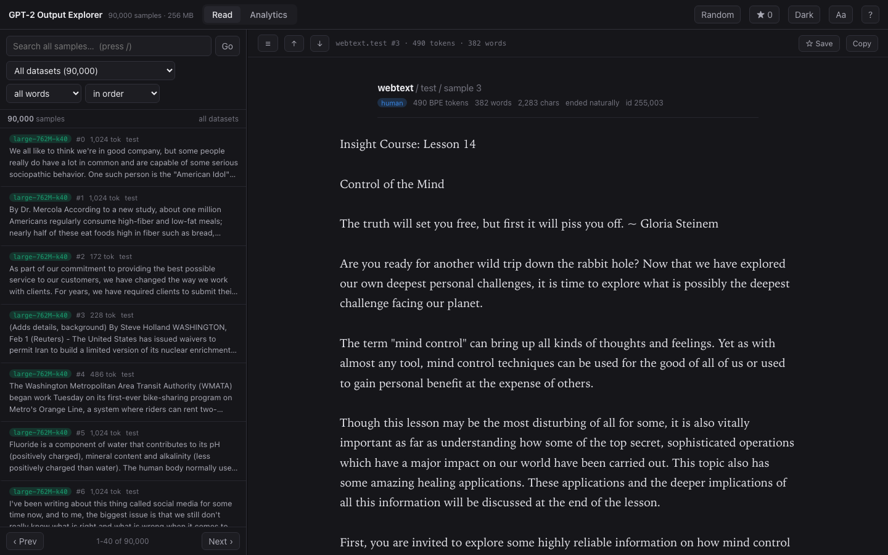

# GPT-2 Samples Explorer

A local web app for reading and searching the [GPT-2 output dataset](https://github.com/openai/gpt-2-output-dataset)
— 250K WebText documents plus samples from every GPT-2 model size, under two
sampling regimes.

This is a fork of OpenAI's `gpt-2-output-dataset` repo. The original dataset
documentation and detection baselines are preserved below and in `detector/`;
everything in `viewer/` is new.



## Quick start

```bash
python3 viewer/run.py
```

That's the whole setup. It will:

1. download 18 `.jsonl` files (the `test` and `valid` splits of all 9 datasets)
   into `data/` — about **260 MB**, a few minutes on a normal connection;
2. build `data/index.db`, a SQLite database with an FTS5 full-text index over all
   90,000 samples — about **420 MB**, roughly two minutes;
3. start a server on <http://127.0.0.1:8008> and open your browser.

Each step is skipped if it's already done, so re-running `run.py` later just
starts the server. Add `--no-browser` if you don't want it opening a tab, and
`--port N` to use a different port.

### Requirements

- **Python 3.9 or newer.** That's it — the viewer uses only the standard library.
  There is nothing to `pip install` and no virtualenv to create.
- **SQLite built with FTS5**, which is the default in CPython on macOS and Linux.
  Check with:

  ```bash
  python3 -c "import sqlite3; sqlite3.connect(':memory:').execute('create virtual table t using fts5(x)'); print('FTS5 ok')"
  ```

- About **700 MB** of free disk for the default splits (260 MB of data + 420 MB
  index). See [More data](#more-data) for the much larger `train` splits.

> `requirements.txt` at the repo root belongs to the **original detection
> baseline** (`baseline.py`, `detector/`), which needs PyTorch and Transformers.
> The viewer does not use it. Do not install it just to run the explorer.

## What you get

**Read** — a two-pane reader: sample list on the left, full text on the right.
Serif at a comfortable measure by default, with typeface, size, line height,
width, tracking and theme (dark / sepia / light) adjustable from the `Aa` menu
and remembered across sessions. Dark is the default. Bookmark samples with `s`,
review them with `b`. Every sample has a stable URL (`#doc/12345`).

**Annotate** — select any passage in the reader to highlight, underline or
strike it in one of five colours, and attach a note to it. Marks are anchored to
character offsets in the sample, so they are re-applied every time you open it
again — from the list, from a search, from a bookmark. The `✎` button opens the
notes panel: every mark you have made, newest first, filterable from the search
box, scoped to all samples or just the one you are reading, and clickable to jump
back to the passage. Delete one mark from that list or from its editor, or use
*Clear…* to wipe the marks on the current sample or every mark at once.
Annotations and bookmarks live in your browser's local storage, not in the index.

**Search** — full-text search across every sample, backed by SQLite FTS5. Four
query modes: *all words*, *any word*, *exact phrase*, and raw FTS5 syntax (for
`NEAR()`, `OR`, prefix matching, and the rest). Hits are highlighted in the
result snippets and again inside the sample itself, with `n` / `N` to jump
between them. Filter to a single dataset with the dropdown.

**Analytics** — corpus totals, then per dataset: vocabulary size, lexical
diversity, mean/median sample length, share of samples that ended on their own,
length distributions, top keywords, top bigrams, the words each model most
over-produces relative to WebText, and a tool to compare any word's frequency
across all nine datasets. Keywords are clickable and search the corpus for you.

### Keyboard

| key | action |
|---|---|
| `j` / `k` | next / previous sample |
| `n` / `N` | next / previous match inside the sample |
| `/` | focus search |
| `r` | random sample |
| `s` / `b` | bookmark / show bookmarks |
| `h` / `u` / `x` | highlight / underline / strike the selection |
| `m` | attach a note to the selection |
| `a` | show notes & highlights |
| `g` | go to a sample index |
| `t` | cycle theme |
| `-` / `=` | text smaller / larger |
| `\` | toggle the list pane |
| `?` | shortcuts |

## Repository layout

| path | what it is |
|---|---|
| `viewer/run.py` | download → index → serve, skipping whatever is already done |
| `viewer/fetch_data.py` | downloads `.jsonl` files from the OpenAI Azure bucket into `data/` |
| `viewer/build_index.py` | builds `data/index.db`: documents, FTS5 index, per-dataset stats, term counts |
| `viewer/app.py` | `http.server` JSON API + static file server |
| `viewer/static/` | the UI (`index.html`, `app.js`, `annotate.js`, `analytics.js`, `style.css`) |
| `viewer/README.md` | fuller notes on the viewer, including how the analytics are computed |
| `data/` | downloaded samples and the index — **gitignored**, created on first run |
| `download_dataset.py` | the original OpenAI download script (needs `requests`, `tqdm`) |
| `baseline.py`, `detector/`, `detection.md` | the original detection baselines (need PyTorch) |

Each viewer script also runs on its own:

```bash
python3 viewer/fetch_data.py --splits test valid   # or a subset: --datasets webtext xl-1542M
python3 viewer/build_index.py                      # --limit 500 for a fast trial index
python3 viewer/app.py --port 8008                  # serve an index that already exists
```

## More data

`run.py` defaults to the `test` and `valid` splits: 5,000 samples per dataset per
split, 90,000 samples total. The `train` splits are far bigger — ~650-750 MB per file,
**~6.5 GB total, 2.25M samples**, and an index in the ~10 GB range. They work, but
budget for a long download and a long index build, and keep around **20 GB free**.
For calibration: indexing a single 250K-sample train file took about 4 minutes and
produced a 1.0 GB index on an Apple-silicon laptop, so the full set lands somewhere
around 40 minutes and ~10 GB:

```bash
python3 viewer/run.py --splits train test valid
```

`run.py` decides on its own whether to build: it rebuilds when there is no index,
when the index doesn't cover every `.jsonl` in `data/` (so adding the train splits
later triggers a rebuild), and when the existing index is corrupt. Force one with:

```bash
python3 viewer/run.py --reindex
```

A build writes to `data/index.db.building` and only swaps it into place when it
finishes, so interrupting one (Ctrl-C, a crash, a reboot) always leaves the
previous index intact rather than a half-written file.

## Troubleshooting

**`No index at .../data/index.db`** — you ran `viewer/app.py` directly before
building an index. Run `python3 viewer/run.py` instead.

**`database disk image is malformed` / `The index ... is unusable`** — the index
was damaged (most often an index build killed partway through by an older version
of this code). The `.jsonl` files in `data/` are unaffected; just rebuild with
`python3 viewer/run.py --reindex`.

**`no such module: fts5`** — your Python's SQLite was built without FTS5. On
macOS use the python.org or Homebrew build rather than a stripped-down one; on
Linux install your distro's `python3` package rather than a minimal static build.

**Port already in use** — `app.py` automatically tries the next 20 ports, so
check the URL it prints. Or pass `--port`.

**A download failed partway** — `fetch_data.py` retries three times per file and
writes to a `.part` file, so a partial download is never mistaken for a complete
one. Just re-run it; completed files are skipped.

**Stale UI after editing `static/`** — the server sends `Cache-Control: no-store`
and version-stamps its own asset URLs, so a normal reload is enough.

---

# The dataset

This dataset contains:
- 250K documents from the WebText test set
- For each GPT-2 model (trained on the WebText training set), 250K random samples
  (temperature 1, no truncation) and 250K samples generated with Top-K 40 truncation

### Download

For each model, there is a training split of 250K generated examples, as well as
validation and test splits of 5K examples.

All data is located in Azure Blob Storage, under
`https://openaipublic.blob.core.windows.net/gpt-2/output-dataset/v1/`.

There, you will find files:

- `webtext.${split}.jsonl`
- `small-117M.${split}.jsonl`
- `small-117M-k40.${split}.jsonl`
- `medium-345M.${split}.jsonl`
- `medium-345M-k40.${split}.jsonl`
- `large-762M.${split}.jsonl`
- `large-762M-k40.${split}.jsonl`
- `xl-1542M.${split}.jsonl`
- `xl-1542M-k40.${split}.jsonl`

where split is one of `train`, `test`, and `valid`.

Each line is one JSON object with the fields `id`, `ended` (whether generation
stopped at an end-of-text token rather than the length cap), `length` (in BPE
tokens) and `text`.

`viewer/fetch_data.py` downloads these; the original `download_dataset.py` does
too, if you prefer it (it needs `requests` and `tqdm`).

#### Finetuned model samples

OpenAI also released samples from a GPT-2 full model finetuned to output Amazon
reviews, under `gs://gpt-2/output-dataset/v1-amazonfinetune/`.

### Detectability baselines

The original repo provides [initial analysis](detection.md) of two baselines, as
well as [code](./baseline.py) for the better one. Overall it achieves accuracies
in the mid-90s for Top-K 40 generations, and mid-70s to high-80s (depending on
model size) for random generations, with some evidence that adversaries can evade
detection via finetuning from released models.

### Data removal requests

If you believe your work is included in WebText and would like it removed,
contact OpenAI at webtextdata@openai.com.

## License

MIT, inherited from [openai/gpt-2-output-dataset](https://github.com/openai/gpt-2-output-dataset).
See [LICENSE](LICENSE).
